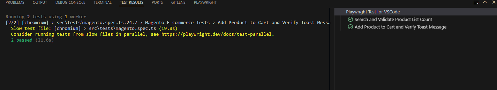

# Magento Test Automation Plan

## URL
[Magento Software Testing Board](https://magento.softwaretestingboard.com/)

## Test Steps
1. **Home Page**
2. Navigate to **Women > Tops > Tees**
3. Search for "women tees"
4. Verify there are exactly **5 products** listed
5. Click on any product
6. Select **size** and **color**, then add the item to the cart
7. Verify the **green toast message** confirming the addition

## Expectations
- Utilize **Page Object Model (POM)**
- Implement **reusable methods**
- Avoid **hard-coded waits**
- Ensure **comprehensive validations**
- Avoid **hard-coded data**
- Do not use **dynamic locators**
